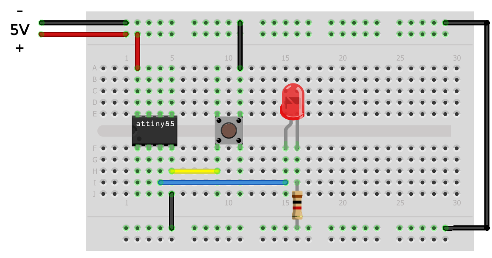

# Acender LED por Pushbutton
Controla o estado de um LED através de um botão

## Software:
* Para acender o LED enquanto o Pushbutton estiver pressionado, grave o programa [Acender LED](AcenderLED/main.c) no AVR.
* Para controlar o estado LED com o Pushbutton, grave o programa [Controlar LED](ControlarLED/main.c) no AVR.

## Hardware:
* ATtiny85
* 1 LED
* 1 Resistor de 1kohm
* Botão (Pushbutton)

