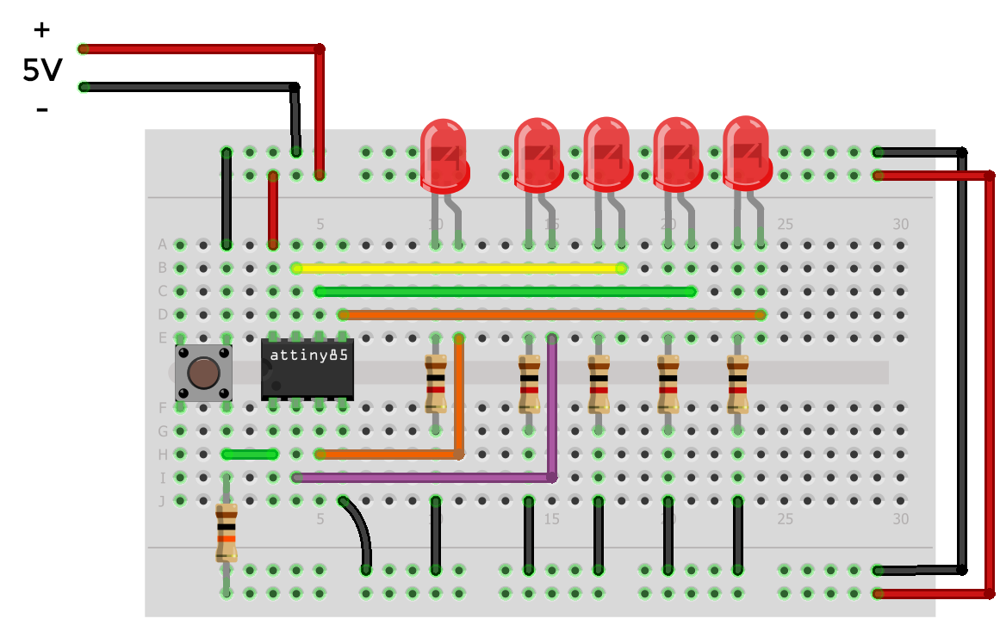

# LEDs no PORTB
Incrementa o valor do PORTB de 0x00 a 0xFF.
Obs.: Só serão aparentes nos LEDs até o valor 0x1F

## Software:
Grave o programa [main.c](main.c) no AVR.

## Hardware:
* ATtiny85
* 5 LEDs
* Resistores de 1kohm para cada LED
* Botão (Pushbutton)
* Resistor de 10kohm para o pullup do botão

