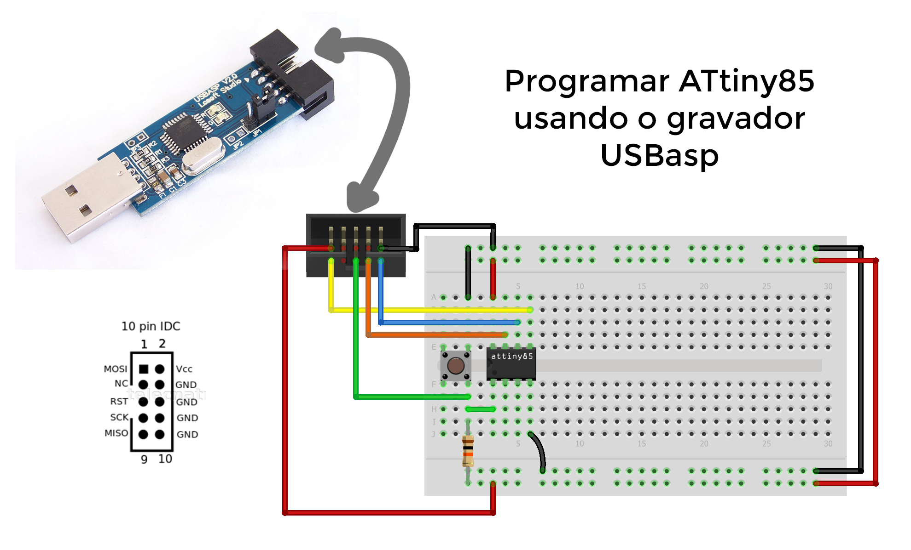
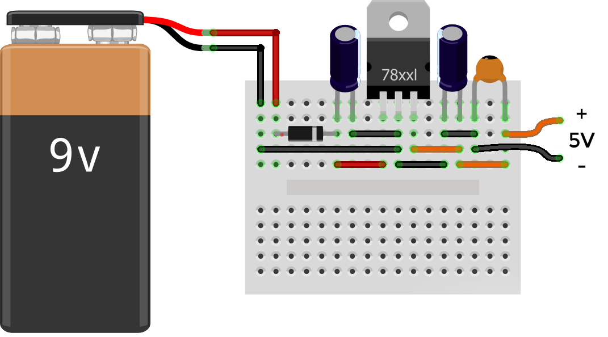

# Microcontroladores AVR

Repositório destinado ao compartilhamento e armazenamento de códigos simples em linguagem C para microcontroladores AVR como ATtiny85 e ATmega328P

## **Exemplos de Hardware**
### **ATtiny85 e USBasp:**



> *Observação:* </br> O gravador alimenta o circuito com os 5V necessários.

## **Softwares**
- IDE ou Editor de Textos ([Atmel Studio](https://www.microchip.com/mplab/avr-support/atmel-studio-7) ou [VScode](https://code.visualstudio.com/))
- Compilador e Bibliotecas (avr-gcc)
- Programa para Gravação do .hex no microcontrolador (avrdude)

<!-- ## **Compilando com _avr-gcc_**
... -->

## **Gravando Microcontrolador com _avrdude_**

* Abra o terminal e navegue até a pasta em que se encontra o arquivo compilado (**exemplo.hex**)

* Execute o comando especificando os parâmetros de acordo com seu hardware e seu projeto:

    ```
    $ avrdude -c SEU_GRAVADOR_AQUI -p SEU_MICROCONTROLADOR_AQUI -U flash:w:SEU_ARQUIVO_AQUI.hex:i
    ```

    Abaixo está um exemplo de uso na gravação do arquivo **exemplo.hex** no microcontrolador **ATtiny85** utilizando o gravador **USBasp**:

    ```
    $ avrdude -c usbasp -p attiny85 -U flash:w:exemplo.hex:i
    ```

<!-- ## **Configurando o Atmel Studio 7 para usar USBasp como  gravador** -->

## **Configurando o VScode para Programar AVRs**
O VScode precisa de algumas configurações para reconhecer as bilbiotecas e ajudar na digitação dos códigos para cada microcontrolador. No diretório "Configurando-VScode" está um exemplo das que fiz.

### **Inclusão de Bibliotecas:**
Por padrão o arquivo **c_cpp_properties.json** encontrado em **.vscode** vem com uma única configuração chamada **Win32**.

O que faremos é adicionar uma nova configuração chamada **AVRs** que essencialmente adiciona apenas o caminho para as bibliotecas em "includePath".

Exemplo:

```json
"${workspaceFolder}/**",
"C:\\WinAVR-20100110\\avr\\include"
```

[Este é o arquivo "c_cpp_properties.json" modificado.](/.vscode/c_cpp_properties.json)

> *Observação:* </br> O acesso a este arquivo pode ser feito através do atalho **Ctrl+Shift+P** e em seguida selecionando a opção **C/C++: Edit Configurations (JSON)**

### **Reconhecer o Microcontrolador:**
Para que o VScode reconheça o microcontrolador em uso e ajude no complemento de palavras, deve-se adicionar a definição do mesmo ao início do código.

Como exemplo o aquivo [main.c](/Configurando-VScode/main.c) para o microcontrolador ATtiny85:

```c
#ifndef __AVR_ATtiny85__
    #define __AVR_ATtiny85__
#endif
```

A definição para cada microcontrolador se encontra no arquivo **io.h**. Podendo ser acessado clicando com o botão direito em **#include <avr/io.h>** e em "Go to definition"

## **Automatizando com o arquivo _Makefile_**
Através de um arquivo *Makefile*, como [este](/Configurando-VScode/Makefile), podemos compilar e gravar o codigo com apenas um comando.

> *Observação:* </br> Este arquivo deve estar na mesma pasta que seu código em C/C++

* Abra o terminal no diretório do projeto

* Modifique as primeiras linhas de acordo com seu hardware

* Para compilar, apenas, execute:
    ```
    $ make compile
    ```

* Para gravar a memória flash do microcontrolador, apenas, execute:
    ```
    $ make upload
    ```

* E, como a compilação cria muitos arquivos, podemos apagá-los executando:
    ```
    $ make clean
    ```

* Para agilizar ainda mais o processo e compilar, gravar e deletar os arquivos adicionais pode-se executar apenas:
    ```
    $ make
    ```

## **Regulador de Tensão**
Após a gravação do código na memória do microcontrolador, podem ser desconectados os fios entre o ATtiny85 e o USBasp. Logo, será necessária uma alimentação externa de 5V para que o circuito funcione. Uma alternativa é o uso de um circuito regulador de tensão com o CI LM7805.
* LM7805 - Regulador de Tensão
* Diodo - Evita danos ao circuito caso a alimentação de entrada (9V) seja ligada de forma incorreta
* Capacitor Eletrolítico de 10uF - Filtro para a entrada do Circuito Regulador
* Capacitor Cerâmico de 10nF - Filtro para a saída do Circuito Regulador
* Capacitor Eletrolítico de 100uF - Filtro para a saída do Circuito Regulador

